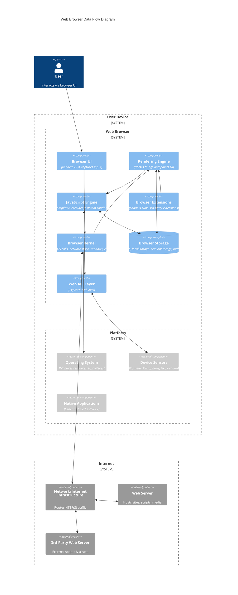

### Threat Model for the Web Platform

#### Use Scenario

The Web Platform is a collection of open (royalty-free) technologies that enable the Web. As a platform, users interact with websites using their user agent (e.g., a Web Browser).

Websites contain a series of file formats, such as HTML, CSS, multimedia files, and scripts, that are transmitted from the server to the user's device, interpreted, and rendered by the browser so the user can use them.   
The web browser is a critical and widely used gateway for accessing the web. It is increasingly relied upon as the single most important application for work, forming the basis of browser-centric workflows.

However, the Web Platform presents significant security and privacy challenges. The browser, designed to request and execute instructions from arbitrary locations on the Internet, must surrender considerable control to web servers to render content correctly, as it runs code from untrusted sources.

#### Components

Main components of a Web Browser:

* **Browser Kernel**: This component interacts with the operating system, manages persistent resources like the cookie and password databases, and handles window management, the location bar, network stack, SSL/TLS, download manager, and clipboard. The Browser Kernel is also responsible for managing multiple instances of the Rendering Engine and implements a security policy for how sandboxed rendering engines can interact with the operating system.
* **Rendering Engine**: is an essential component in the browser ecosystem. They convert data, such as HTML and images, often in combination with CSS, into a graphical format for presentation to the user on the screen. There are also non-HTML document types (e.g., plaintext files, bitmap images, audio and video, XML-based documents, SVG...) 
* **Browser Extensions**: Third-party creators develop Browser Extensions to enhance browser functionality by adding diverse features. They enable users to customize and improve their browsing experiences.
* **Storage** Browsers offer various mechanisms for storing data locally on a user's device, which vary in lifetime and capacity.
  - **Cookies** are small files (up to 4KB) sent with each HTTP request to the server to manage sessions, track users, and personalize them. The **Cookie Jar** is the browser's local database for storing cookie information.
  - **localStorage** allows for the persistent storage of key-value pairs accessible within the same origin, often used for non-sensitive data like user preferences or themes.
  - **sessionStorage** functions similarly to localStorage, but the data is only available for the page session duration and expires when the browser tab is closed.
  - **IndexedDB** is another mechanism that origins can use to store information.
* **JavaScript Engine/Interpreter**: JavaScript is a general-purpose scripting language. It allows limited interaction with the host environment through predefined methods and properties that map to native code inside the browser.
* **Web APIs/Browser API** are interfaces with functionalities available to Web Developers.

#### External Dependencies

The web browser operates within an ecosystem that includes several external dependencies, systems, or entities it interacts with or relies upon:

*   **Operating System (OS)**: The browser runs with privileges granted by the OS, equivalent to user privileges. Browser security goals must manifest correctly between tabs, websites, and the OS. The OS provides a higher level of security against direct network connections than browsers.
*   **Network/Internet Infrastructure**: The browser's primary function involves requesting instructions and content from arbitrary locations on the Internet. This relies on the underlying network protocols like TCP/IP, which the browser presumably trusts. The decentralised nature of the internet means unencrypted data is likely being read by someone.
*   **Web Servers and their backend**: These are the primary source of content, instructions (scripts, HTML), and resources for the browser. The browser must surrender control and execute commands provided by the server. A web server can also reduce a browser's security. Websites interact with databases, off-site storage, and corporate data centres. Data flows between the browser context and these backend systems.
*   **Third Parties/Other Origins**: Modern web applications often include resources and scripts from other origins, which must also be executed. Websites may depend on third parties for ads, analytics, or authentication databases.
*   **Native Applications**: Other applications installed on the user's system can potentially access browser assets directly (e.g., via file system or memory inspection).
*   **Cryptography**: The use of and interaction with cryptographic protocols, although not specifically an input, is a category of threats to be taken into account, particularly at this moment in history in relation to the transition to post-quantum cryptography.
*   **External Components/Systems**: Any external dependency on components or systems can impact the browser's security.

#### Entry Points

Entry points are interfaces or mechanisms through which an adversary can interact with or supply data to the system. For a web browser, these include:

*   **The Browser UI**: The user interface itself, where user input is provided. It includes also Trusted UI.
*   **Network Interfaces**: Ports and protocols the browser uses to communicate over the network (e.g., Sockets, RPC, HTTP/HTTPS ports).
*   **Web Content (HTML, CSS, Scripts, Media)**: Malicious code, scripts, or content delivered from web servers. The browser runs code from untrusted sources when presented with scripts. An adversary can convince the browser to render malicious content. Specific threats are linked to the specific file formats.
*   **User Input Fields**: Any area where users can input data, which can be manipulated maliciously (e.g., forms, URLs).
*   **Browser Extensions/Plugins APIs**: The browser exposes interfaces for extensions to interact with the browser and web content.
*   **Web APIs**: Both standard web APIs and potentially new, interesting APIs the browser exposes.
*   **Underlying Platform**: Features allowing an origin to send data to the underlying platform.

#### Assets

The assets that need to be protected when considering the web browser threat model are diverse and critical to user security and privacy:

*   **User Data**: General user data, sensitive data, and personally identifying information.
*   **User Data Privacy**: The ability of users to control and protect their private information and activities from surveillance, correlation, and identification. This includes avoiding identifying or correlating within and across browsing sessions without transparency or control.
*   **User Credentials**: Login information, usernames, and passwords.
*   **User Cookies and Session Information**: Data stored in cookies, session IDs, and session state. These can be used to recognize users across visits.
*   **User Device/Computer**: The user's machine and its resources, including the confidentiality and integrity of the user’s file system.
*   **Local Storage**: Data stored locally by the browser, including cookies, localStorage, indexedDB, cache, history, and passwords.
*   **User Browsing History**: Information about sites visited.
*   **User Environment Information**: Operating system configuration, browser configuration, hardware capabilities.
*   **User Activities and Interests**: Purchasing preferences, personal characteristics, and prior activities.
*   **Protected Resources**: Any resource the user can access that should not be accessed by an adversary.
*   **Private Network Resources**: These are different network resources that the browser can access without the user's explicit request.
*   **Credentials and Encryption Keys**: The browser manages Public and secret keys for encryption and signing.
*   **Confidential Information on Websites**: Data displayed or accessible on websites.

#### High-level threats and threat sources

*   **Browser Extensions**: Browser extensions introduce numerous security vulnerabilities despite their utility. Malicious actors exploit them for sophisticated attacks like phishing, keylogging, spying, data theft, and session hijacking. They need to be installed and configured to have the permission to access a specific origin, which increases the complexity of the attack.
*   **Applications/Websites**: Websites can be compromised and malicious. Different attacks can be directed to compromise the user's session on the same website (e.g., stealing cookies or generating arbitrary requests), bypass the same origin and get information from different websites (i.e. Cross-Site Leaks - XS Leaks), or compromise the Browser itself (e.g., running arbitrary code into the browser processes to obtain control of the data inside the browser or to compromise the user device). Adversaries exploit existing browser functionality.
*   **Tracking/Privacy Loss**: Browser fingerprinting is a method to identify a user, correlate browsing activity within and across sessions, and track users without their knowledge or consent. This raises privacy concerns, allowing parties to develop user profiles or histories across different sites, often without knowledge or consent. When correlated with identifying information, fingerprinting can identify otherwise pseudonymous users. Techniques like clearing cookies or using a VPN may not prevent this correlation. Data exposed by specifications, especially information about the underlying platform or state that persists, can contribute to fingerprinting.

#### Security Features

Web browsers employ a variety of security features and protection mechanisms to defend against threats:

*   **Sandboxing**: Sandboxing is a key mechanism for confining components like the rendering engine, restricting their access to the operating system and user files. It acts as a barrier between OS privileges and subprocess privileges.
*   **Same Origin Policy (SOP)**: A fundamental security control that restricts how a document or script loaded from one origin can interact with a resource from another origin.
*   **Content Security Policy (CSP)**: A security standard to prevent XSS, clickjacking, and other code injection attacks by specifying which dynamic resources can load.
*   **HTTPS/SSL/TLS**: Protocols for secure, encrypted communication between the browser and web servers, ensuring data integrity and confidentiality in transit. HTTP Strict Transport Security (HSTS) is related.
*   **Input Validation and Output Encoding**: These are crucial practices for handling user-supplied data to prevent injection attacks like XSS.
*   **Security Headers**: HTTP headers instruct browsers on handling content securely.
*   **Anti-Phishing and Anti-Malware**: Features like Safe Browsing warn users about malicious websites.
*   **Mixed Content Handling**: How the browser treats secure (HTTPS) pages that load insecure (HTTP) resources.
*   **Renderer Isolation**: Architectures that place complex, error-prone components like the rendering engine in a separate, sandboxed process or protection domain from the browser kernel. The browser kernel handles sensitive OS, network, and storage interactions.
*   **Inter-process Communication (IPC)**: Secure channels for communication between isolated browser components (e.g., kernel and renderer).
*   **Download Manager**: Component handling file downloads, potentially including security checks.
*   **Data Minimization and Default Privacy Settings**: Design principles and configurations to reduce the exposure of potentially identifying information.
*   **Trusted UI**: Ensuring sensitive user interactions occur within browser interfaces that web content cannot easily spoof or manipulate.
*   **Permission API**: Asking the user before the activation of a powerful feature 

#### Data Flow Diagram

The diagram illustrates the data flow and interactions between core browser components, external entities, and specific elements like storage, extensions, and device sensors.

